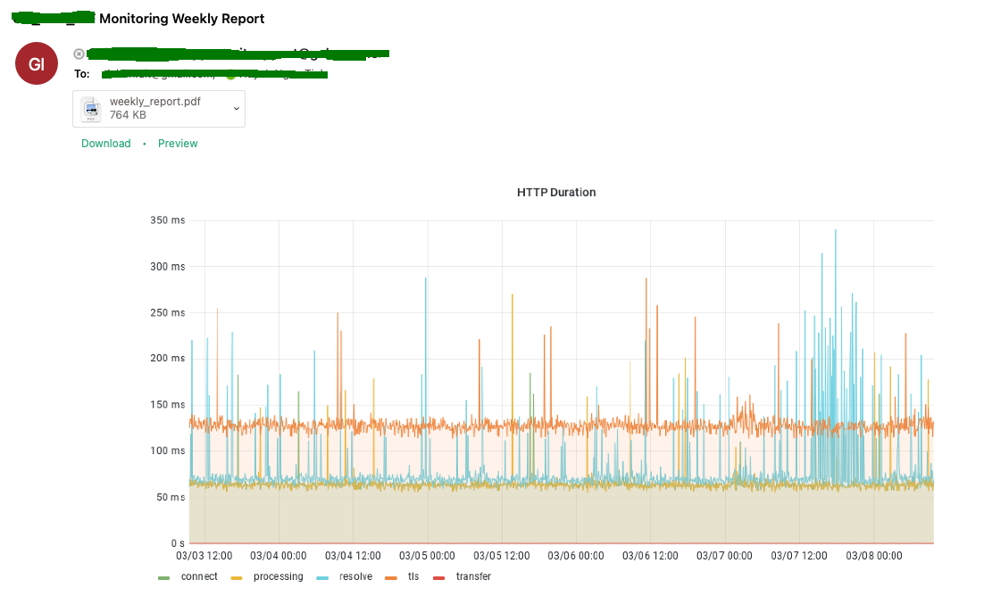

# grafana-report-sending
Call Grafana Reporter (https://github.com/IzakMarais/reporter) to get Grafana Report and send an email.

# Docker run
```bash
docker run --rm -it \
-e DASHBOARD_ID=ZEUtSI1Vk \
-e EMAIL_FROM=email1@example.com  \
-e EMAIL_HOST=smtp.example.com  \
-e EMAIL_PASSWORD=email1password  \
-e EMAIL_PORT=587 \
-e EMAIL_SUBJECT="Monitoring Weekly Report"  \
-e EMAIL_TO=email2@example.com,email3@example.com  \
-e GRAFANA_REPORTER_URL=https://grafana-reporter.example.com \
-e GRAFANA_TOKEN=eyJrIjoiN2abcdefghijklmonpqrst== \
-e PYTHONUNBUFFERED=1 \
-e TIMESPAN_FROM=now-7d \
-e TIMESPAN_TO=now \
tinhgin/grafana-report-sending
```

# Sample output log
```
INFO:GRAFANA_REPORT_SENDING:Getting Grafana report file
2023-03-08T09:12:43.572069757Z INFO:GRAFANA_REPORT_SENDING:Attach Grafana report file to the email
2023-03-08T09:12:43.620962757Z INFO:GRAFANA_REPORT_SENDING:Converting PDF to PNG
2023-03-08T09:13:02.808772169Z INFO:GRAFANA_REPORT_SENDING:Attach report file as Email preview
2023-03-08T09:13:02.842727044Z INFO:GRAFANA_REPORT_SENDING:Sending the email
```

# Example email
